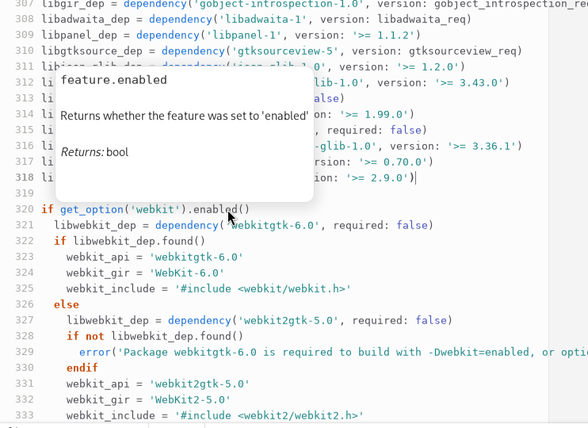
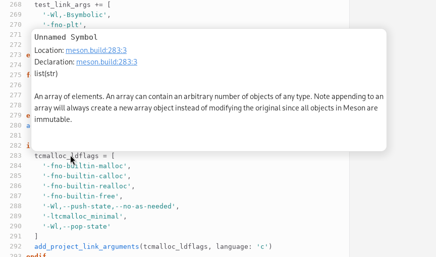
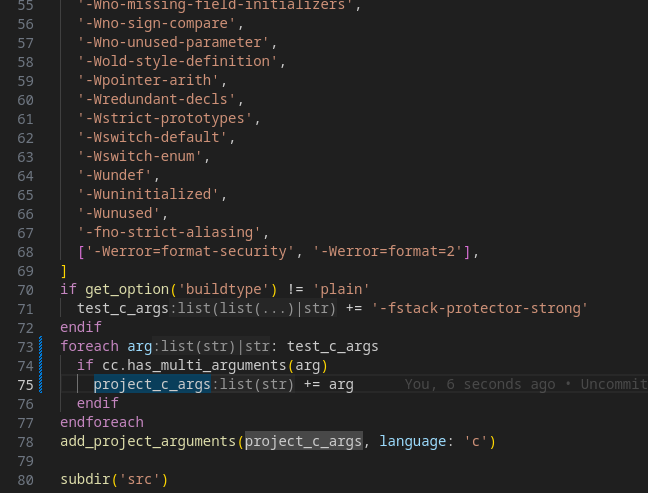
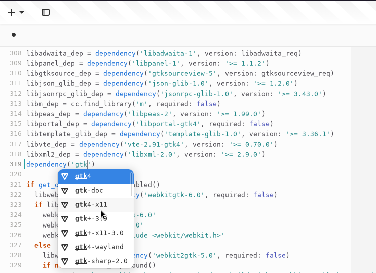

# MesonLSP
[](https://copr.fedorainfracloud.org/coprs/jcwasmx86/Swift-MesonLSP/package/Swift-MesonLSP/)
[](https://www.codefactor.io/repository/github/jcwasmx86/swift-mesonlsp)
[](https://codecov.io/github/JCWasmx86/Swift-MesonLSP)

[](https://repology.org/project/swift-mesonlsp/versions)

A reimplementation of my Meson language server in C++ (Formerly Swift).
It's there for providing code intelligence in editors using the language server protocol.

## Current feature set
- Hovering
- Symbol resolving
- Jump-To-Definition
- Jump-To-Subdir
- A basic set of diagnostics
- Formatting
- Document symbols
- Autocompletion (Somewhat working)
- Inlay hints
- Highlighting
- Automatic subproject/wrap downloads
- Code actions
- Renaming
- Semantic Highlighting
- Folding






## Limitations
- `set_variable`/`get_variable` with non-constant variable name will fail in more complex cases.
- `subdir` with non-constant subdir name will fail in more complex cases.
- Type deduction is not 100% correct yet
- Type definitions may have minor errors regarding:
  - Is this argument optional?
  - What is the type of the argument?

## Why a reimplementation?
The first version, written in Vala, had some code maintenance problems because basically everything was done in one file.
I had the choice between untangling that mess or rewriting it as cleanly as possible.
I have chosen the latter because I wanted to learn Swift.

And now rewrote it in C++ for more performance, a better buildsystem and to address technical debt.

## Installation
### Install the language server
#### Easy way
- For Fedora, a COPR is provided: https://copr.fedorainfracloud.org/coprs/jcwasmx86/Swift-MesonLSP/
- For Arch, you can use the repo from [AUR](https://aur.archlinux.org/packages/swift-mesonlsp) **NOTE: It's only for the Swift versions, not the C++-Versions, Maintainers needed**
- For Ubuntu 18.04,20.04,22.04 and Debian Bullseye, Bookworm, Sid you can use: https://github.com/JCWasmx86/swift-mesonlsp-apt-repo **NOTE: It's only for the Swift versions, not the C++-Versions, Maintainers needed**
- For Ubuntu 22.04, MacOS 12, MacOS 13 and Windows, you can download binaries from the release section: https://github.com/JCWasmx86/Swift-MesonLSP/releases/latest

#### Compile from source
```
# Install the dependencies...
git clone https://github.com/JCWasmx86/MesonLSP
cd MesonLSP
meson setup _build --buildtype release -Db_lto=true
ninja -C _build
sudo ninja -C _build install
```

### Connect with your editor
#### VSCode (Official support)
Install the official meson extension. If you don't have MesonLSP in the PATH,
it will ask you whether it should download the language server.
#### GNOME Builder 45 and GNOME Builder Nightly (Official support)
You have to do nothing. The editor already has the support code for MesonLSP. All you have to do is
installing the language server.
#### Kate (No official support)
Add this JSON to `~/.config/kate/lspclient/settings.json`:
```
{
  "servers": {
    "meson": {
      "command": [
        "mesonlsp",
        "--lsp"
      ],
      "rootIndicationFileNames": [
        "meson.build",
        "meson_options.txt"
      ],
      "url": "https://github.com/JCWasmx86/MesonLSP",
      "highlightingModeRegex": "^Meson$"
    }
  }
}
```
After that, a dialog should be shown asking you to confirm that the language server may be started.

#### neovim (No official support)
Add this JSON to `:CocConfig`:
```
{
    "languageserver": {
        "meson": {
            "command": "MesonLSP",
            "args": ["--lsp"],
            "rootPatterns": ["meson.build"],
            "filetypes": ["meson"]
        }
    }
}
```

## Want to contribute?
Take an item from the TODO list in [PROGRESS.md](PROGRESS.md) and work on it. Feel
free to join the matrix channel [#mesonlsp:matrix.org](https://matrix.to/#/#mesonlsp:matrix.org)

### Projects I tested the language server with
- Working fine:
  - [Fractal](https://gitlab.gnome.org/GNOME/fractal)
  - [GitG](https://gitlab.gnome.org/GNOME/gitg)
  - [GLib](https://gitlab.gnome.org/GNOME/glib)
  - [GNOME Builder](https://gitlab.gnome.org/GNOME/gnome-builder)
  - [GNOME Builder Plugins](https://github.com/JCWasmx86/GNOME-Builder-Plugins)
  - [GTK](https://gitlab.gnome.org/GNOME/gtk)
  - [libswiftdemangle](https://github.com/JCWasmx86/libswiftdemangle)
  - [Mesa](https://gitlab.freedesktop.org/mesa/mesa)
  - [QEMU](https://gitlab.com/qemu-project/qemu)
  - [rustc-demangle](https://github.com/JCWasmx86/rustc-demangle)
  - [Systemd](https://github.com/systemd/systemd)
  - [GStreamer](https://gitlab.freedesktop.org/gstreamer/gstreamer)
- Somewhat flaky to unusable
  - [HelenOS](http://www.helenos.org/)
  - [picolibc](https://github.com/picolibc/picolibc)
  - [DPDK](https://www.dpdk.org/)

